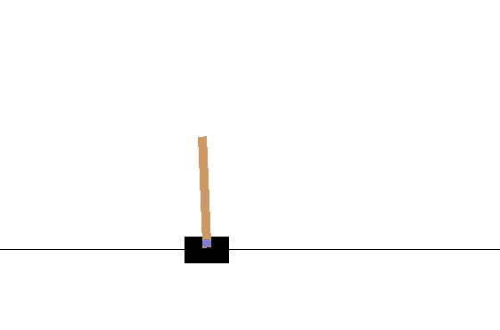

# DRL_CartPole

Navigation project: Train an agent via a deep reinforcement algorithm to complete a navigation task.

### Introduction

<p align="center">
  
</p>

In this project we train an agent to balance a pole. This is a classic control theory problem. Here we solve it using standard drl techniques.

The [specification of the environment](http://gym.openai.com/envs/CartPole-v1/) reads as:

A pole is attached to a cart, which can move along a frictionless track.  The cart can be moved to the left and to the right. The pole starts upright and the aim is to keep it like this as long as possible. A reward of +1 is given to the agent for every time step that the pole has not fallen. The episode is over whenever the pole is more than 15 degrees from the vertical position, or the cart moves more than 2.4 units from the center.

For completeness, we give the gym details of the environment:

```
State shape:  Box(4,)
Number of actions:  Discrete(2)
```
### Getting Started

To run the environment the **gym** package has to be installed.

Computations were done using python 3.7. In addition, the following packages were mounted: **matplotlib**, **numpy**, **torch**.

### Instructions

The project can be run by starting the Deep_Q_Network.py file. This main file calls the learning agent and the neural network which are saved in `dqn_agent.py` and `model.py`, respectively. Results of the analysis are collected in the `report.md` file.

### License
This repository is licensed under the MIT License.
