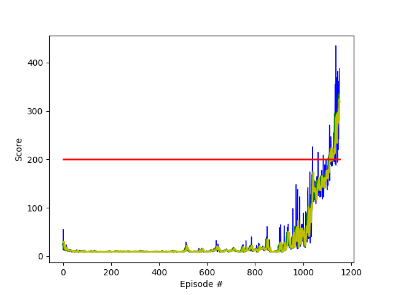

# Project report

## Learning algorithm

The employed learning algorithm is the standard Deep Q-Learning algorithm which was introduced in the article [Human-level control through deep reinforcement learning](https://storage.googleapis.com/deepmind-media/dqn/DQNNaturePaper.pdf) to solve [Markov Decision Processes](https://en.wikipedia.org/wiki/Markov_decision_process).

Due to the fact that we are using state vectors as an input and not image data we use a simple deep neural network instead of a convolutional neural network to determine the action-value function. The former consists of the following 4 layers coded into the model.py file:

- Fully connected layer - input: 8 (state size) output: 64
- Fully connected layer - input: 64 output: 32
- Fully connected layer - input: 32 output: 16
- Fully connected layer - input: 16 output: 2 (action size)

We speficy the parameters used in the Deep Q-Learning algorithm:

- We set the number of episodes n_episodes to 20000. The number of episodes needed to solve the environment and reach a score of 195.00 is expected to be smaller.
- We set the maximum number of steps per episode max_t to 1000.
- We start with an epsilion eps_start of 1.0.
- We end with an epsilion eps_end of 0.01.
- We set the epsilion decay rate eps_decay to 0.95 which is rather greedy.

Furthermore we give the parameters used in the dqn_agent.py file:

- The size of the replay buffer BUFFER_SIZE is set to 10^6.
- The mini batch size BATCH_SIZE is set to 64.
- The discount factor GAMMA for future rewards is set to 0.99.
- We set the value for soft update of target parameters TAU to 5 * 10^-3.
- The learning rate for the gradient descent LR is set to 5 * 10^-4.
- The update rate UPDATE_EVERY is set to 4 meaning that every 8 steps a gradient descent update at minibatch size is done.

## Results

With the above specifications we report the results.

First we give a plot of the scores over the episodes:

<p align="center">
  
</p>

Therein, we applied a simple and exponential moving average function at window sizes of 5  (green and yellow plot, respectively) overlaying the original data (blue). The red line indicates the threshold 195.00. More information on how to construct these moving averages in python can be found under the following links:
[Moving average in python](https://www.quora.com/How-do-I-perform-moving-average-in-Python) and [Exponential Moving average in python](https://www.youtube.com/watch?v=3y9GESSZmS0). Notice that the exponential moving average gives more emphasis to recent data than the simple version of it. In general, [moving averages](https://en.wikipedia.org/wiki/Moving_average) are a method to smoothen time and data series.

Then we give the average score for the last bunch of episodes and print the point where the agent reaches a score equal or higher than 195.00: 

```
Episode 1120	Average Score: 145.94
Episode 1121	Average Score: 146.65
Episode 1122	Average Score: 147.66
Episode 1123	Average Score: 149.27
Episode 1124	Average Score: 151.05
Episode 1125	Average Score: 152.56
Episode 1126	Average Score: 154.24
Episode 1127	Average Score: 155.75
Episode 1128	Average Score: 157.32
Episode 1129	Average Score: 157.65
Episode 1130	Average Score: 159.20
Episode 1131	Average Score: 160.89
Episode 1132	Average Score: 162.36
Episode 1133	Average Score: 163.54
Episode 1134	Average Score: 165.97
Episode 1135	Average Score: 166.77
Episode 1136	Average Score: 168.81
Episode 1137	Average Score: 171.95
Episode 1138	Average Score: 172.88
Episode 1139	Average Score: 173.63
Episode 1140	Average Score: 173.96
Episode 1141	Average Score: 175.05
Episode 1142	Average Score: 176.22
Episode 1143	Average Score: 178.41
Episode 1144	Average Score: 179.21
Episode 1145	Average Score: 181.40
Episode 1146	Average Score: 182.97
Episode 1147	Average Score: 183.79
Episode 1148	Average Score: 185.80
Episode 1149	Average Score: 186.99
Episode 1150	Average Score: 189.05
Episode 1151	Average Score: 190.88
Episode 1152	Average Score: 193.30
Episode 1153	Average Score: 195.99
With the given parameters the environment is solved in 1153 episodes. 	
The precise average score is 195.99 there.
```

## Possible extensions of the setting and future work

1. The hyperparameters should be optimized: For example, we could change the epsilon decay rate, the learning rate, the batch size and improve the network structure (more/less layers and units; overfitting could be tackled using dropout).

Further improvements of the Deep Q-Learning algorithm have been introduced in different articles:

2. [Prioritized Experience Replay](https://arxiv.org/abs/1511.05952): In this work the authors extend the idea of experience replay. They introduce a method which prioritizes experiences by replaying important transitions more often which accelerates the learning rate. 

3. [Double Q-learning](https://papers.nips.cc/paper/3964-double-q-learning): This method deals with the problem of overestimation, resulting from a positive bias that is introduced because Q-learning uses the maximum action value as an approximation for the maximum expected action value. In this work the authors introduce a double estimator method and show that this method performs well in cases were Q-learning tends to overestimation.

4. [Dueling Network Architectures for Deep Reinforcement Learning](https://arxiv.org/abs/1511.06581): In this paper, the authors present a neural network architecture with two branches leading to two estimators: one for the state value function _V(s)_ and one for the state-dependent action advantage function _A(s,a)_. This quantifies the improvement of taking one action compared to the rest. Calculating the value function independently allows the agent to learn the value of the state without the effect of choosing one action over the others. This becomes advantageous for environments where the effect of a single actions on states is not too extensive.

5. [Rainbow: Combining Improvements in Deep Reinforcement Learning](https://arxiv.org/abs/1710.02298): In this paper the authors discuss a combination of multiple possible improvements, such as Learning from multi-step bootstrap targets, Distributional DQN and Noisy DQN. It is shown that in many cases the combination of these methods leads to remarkable improvement in the performance. 
